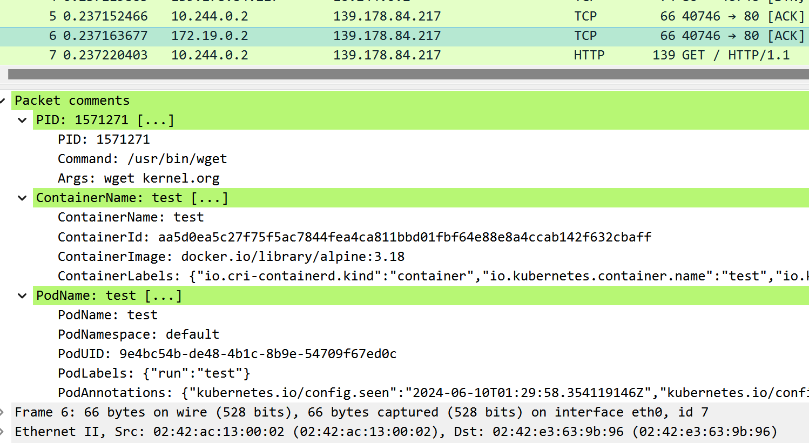

# ptcpdump

<div id="top"></div>

[%20e2e)](https://github.com/mozillazg/ptcpdump/actions/workflows/test.yml)
[%20e2e)](https://app.circleci.com/pipelines/github/mozillazg/ptcpdump?branch=master)
English | [中文](README.zh-CN.md)


ptcpdump is an eBPF-based implementation of tcpdump that includes an additional feature:
it adds process information as comments for each packet when available.
Inspired by [jschwinger233/skbdump](https://github.com/jschwinger233/skbdump).



Table of Contents
=================

* [Features](#features)
* [Installation](#installation)
    * [Requirements](#requirements)
* [Usage](#usage)
    * [Example commands](#example-commands)
    * [Example output](#example-output)
    * [Running with Docker](#running-with-docker)
    * [Backend](#backend)
    * [Flags](#flags)
* [Compare with tcpdump](#compare-with-tcpdump)
* [Developing](#developing)
    * [Dependencies](#dependencies)
    * [Building](#building)


## Features

* Process-aware
  * Aware of the process information associated with the packets.
  * Supports filtering packets by process ID and process name.
* Container-aware and Kubernetes-aware
  * Aware of the container and pod information associated with the packets.
  * Supports multiple container runtimes: Docker Engine and containerd
  * Supports filtering packets by container ID, container name and pod name.
* Supports using pcap-filter(7) syntax for filtering packets.
* Directly applies filters in the kernel space.
* Supports saving captured packets in the PcapNG format for offline analysis with third-party tools such as Wireshark/tshark/tcpdump.
* Supports packet capture for network interfaces under the specified network namespace.


## Installation

You can download the statically linked executable for x86_64 and arm64 from the [releases page](https://github.com/mozillazg/ptcpdump/releases).


### Requirements

Linux kernel >= 5.2 (compiled with BPF and BTF support).

<p align="right"><a href="#top">🔝</a></p>


## Usage

### Example commands

Filter like tcpdump:

```
sudo ptcpdump -i eth0 tcp
sudo ptcpdump -i eth0 -A -s 0 -n -v tcp and port 80 and host 10.10.1.1
sudo ptcpdump -i eth0 'tcp[tcpflags] & (tcp-syn|tcp-fin) != 0'
```

Multiple interfaces:

```
sudo ptcpdump -i eth0 -i lo
```

Filter by process:

```
sudo ptcpdump -i any --pid 1234 --pid 233 -f
sudo ptcpdump -i any --pname curl
```

Capture by process via run target program:

```
sudo ptcpdump -i any -- curl ubuntu.com
```

Filter by container:

```
sudo ptcpdump -i any --container-id 36f0310403b1
sudo ptcpdump -i any --container-name test
```

Filter by Pod:

```
sudo ptcpdump -i any --pod-name test.default
```

Save data in PcapNG format:

```
sudo ptcpdump -i any -w demo.pcapng
sudo ptcpdump -i any -w - port 80 | tcpdump -n -r -
sudo ptcpdump -i any -w - port 80 | tshark -r -
```


Capturing interfaces in other network namespaces:

```
sudo ptcpdump -i lo --netns /run/netns/foo --netns /run/netns/bar
sudo ptcpdump -i any --netns /run/netns/foobar
sudo ptcpdump -i any --netns /proc/26/ns/net
```


<p align="right"><a href="#top">🔝</a></p>


### Example output


Default:

```
09:32:09.718892 vethee2a302f wget.3553008 In IP 10.244.0.2.33426 > 139.178.84.217.80: Flags [S], seq 4113492822, win 64240, length 0, ParentProc [python3.834381], Container [test], Pod [test.default]
09:32:09.718941 eth0 wget.3553008 Out IP 172.19.0.2.33426 > 139.178.84.217.80: Flags [S], seq 4113492822, win 64240, length 0, ParentProc [python3.834381], Container [test], Pod [test.default]
```

With `-q`:

```
09:32:09.718892 vethee2a302f wget.3553008 In IP 10.244.0.2.33426 > 139.178.84.217.80: tcp 0, ParentProc [python3.834381], Container [test], Pod [test.default]
09:32:09.718941 eth0 wget.3553008 Out IP 172.19.0.2.33426 > 139.178.84.217.80: tcp 0, ParentProc [python3.834381], Container [test], Pod [test.default]
```

With `-v`:

```
13:44:41.529003 eth0 In IP (tos 0x4, ttl 45, id 45428, offset 0, flags [DF], proto TCP (6), length 52)
    139.178.84.217.443 > 172.19.0.2.42606: Flags [.], cksum 0x5284, seq 3173118145, ack 1385712707, win 118, options [nop,nop,TS val 134560683 ecr 1627716996], length 0
    Process (pid 553587, cmd /usr/bin/wget, args wget kernel.org)
    ParentProc (pid 553296, cmd /bin/sh, args sh)
    Container (name test, id d9028334568bf75a5a084963a8f98f78c56bba7f45f823b3780a135b71b91e95, image docker.io/library/alpine:3.18, labels {"io.cri-containerd.kind":"container","io.kubernetes.container.name":"test","io.kubernetes.pod.name":"test","io.kubernetes.pod.namespace":"default","io.kubernetes.pod.uid":"9e4bc54b-de48-4b1c-8b9e-54709f67ed0c"})
    Pod (name test, namespace default, UID 9e4bc54b-de48-4b1c-8b9e-54709f67ed0c, labels {"run":"test"}, annotations {"kubernetes.io/config.seen":"2024-07-21T12:41:00.460249620Z","kubernetes.io/config.source":"api"})
```

Using `--context` to limit context to include in the output:

```
# --context=process
09:32:09.718892 vethee2a302f wget.3553008 In IP 10.244.0.2.33426 > 139.178.84.217.80: Flags [S], seq 4113492822, win 64240, length 0

# -v --context=process
13:44:41.529003 eth0 In IP (tos 0x4, ttl 45, id 45428, offset 0, flags [DF], proto TCP (6), length 52)
    139.178.84.217.443 > 172.19.0.2.42606: Flags [.], cksum 0x5284, seq 3173118145, ack 1385712707, win 118, options [nop,nop,TS val 134560683 ecr 1627716996], length 0
    Process (pid 553587, cmd /usr/bin/wget, args wget kernel.org)

# -v --context=process,parentproc,container,pod
# or -v --context=process --context=parentproc --context=container --context=pod
13:44:41.529003 eth0 In IP (tos 0x4, ttl 45, id 45428, offset 0, flags [DF], proto TCP (6), length 52)
    139.178.84.217.443 > 172.19.0.2.42606: Flags [.], cksum 0x5284, seq 3173118145, ack 1385712707, win 118, options [nop,nop,TS val 134560683 ecr 1627716996], length 0
    Process (pid 553587, cmd /usr/bin/wget, args wget kernel.org)
    ParentProc (pid 553296, cmd /bin/sh, args sh)
    Container (name test, id d9028334568bf75a5a084963a8f98f78c56bba7f45f823b3780a135b71b91e95, image docker.io/library/alpine:3.18, labels {"io.cri-containerd.kind":"container","io.kubernetes.container.name":"test","io.kubernetes.pod.name":"test","io.kubernetes.pod.namespace":"default","io.kubernetes.pod.uid":"9e4bc54b-de48-4b1c-8b9e-54709f67ed0c"})
    Pod (name test, namespace default, UID 9e4bc54b-de48-4b1c-8b9e-54709f67ed0c, labels {"run":"test"}, annotations {"kubernetes.io/config.seen":"2024-07-21T12:41:00.460249620Z","kubernetes.io/config.source":"api"})
```


With `-A`:

```
14:44:34.457504 ens33 curl.205562 Out IP 10.0.2.15.39984 > 139.178.84.217.80: Flags [P.], seq 2722472188:2722472262, ack 892036871, win 64240, length 74, ParentProc [bash.180205]
E..r.,@.@.o.
.....T..0.P.E..5+g.P.......GET / HTTP/1.1
Host: kernel.org
User-Agent: curl/7.81.0
Accept: */*

```

With `-x`:

```
14:44:34.457504 ens33 curl.205562 Out IP 10.0.2.15.39984 > 139.178.84.217.80: Flags [P.], seq 2722472188:2722472262, ack 892036871, win 64240, length 74, ParentProc [bash.180205]
        0x0000:  4500 0072 de2c 4000 4006 6fbf 0a00 020f
        0x0010:  8bb2 54d9 9c30 0050 a245 a0fc 352b 6707
        0x0020:  5018 faf0 ecfe 0000 4745 5420 2f20 4854
        0x0030:  5450 2f31 2e31 0d0a 486f 7374 3a20 6b65
        0x0040:  726e 656c 2e6f 7267 0d0a 5573 6572 2d41
        0x0050:  6765 6e74 3a20 6375 726c 2f37 2e38 312e
        0x0060:  300d 0a41 6363 6570 743a 202a 2f2a 0d0a
        0x0070:  0d0a
```

With `-X`:

```
14:44:34.457504 ens33 curl.205562 Out IP 10.0.2.15.39984 > 139.178.84.217.80: Flags [P.], seq 2722472188:2722472262, ack 892036871, win 64240, length 74, ParentProc [bash.180205]
        0x0000:  4500 0072 de2c 4000 4006 6fbf 0a00 020f  E..r.,@.@.o.....
        0x0010:  8bb2 54d9 9c30 0050 a245 a0fc 352b 6707  ..T..0.P.E..5+g.
        0x0020:  5018 faf0 ecfe 0000 4745 5420 2f20 4854  P.......GET / HT
        0x0030:  5450 2f31 2e31 0d0a 486f 7374 3a20 6b65  TP/1.1..Host: ke
        0x0040:  726e 656c 2e6f 7267 0d0a 5573 6572 2d41  rnel.org..User-A
        0x0050:  6765 6e74 3a20 6375 726c 2f37 2e38 312e  gent: curl/7.81.
        0x0060:  300d 0a41 6363 6570 743a 202a 2f2a 0d0a  0..Accept: */*..
        0x0070:  0d0a                                     ..
```


<p align="right"><a href="#top">🔝</a></p>


### Running with Docker

Docker images for `ptcpdump` are published at https://quay.io/repository/ptcpdump/ptcpdump.

```
docker run --privileged --rm -t --net=host --pid=host \
  -v /sys/fs/cgroup:/sys/fs/cgroup:ro \
  -v /var/run:/var/run:ro \
  -v /run:/run:ro \
  quay.io/ptcpdump/ptcpdump:latest ptcpdump -i any -c 2 tcp
```

<p align="right"><a href="#top">🔝</a></p>


### Backend


ptcpdump supports specifying a particular eBPF technology for packet capture through the
`--backend` flag.

| --backend    | eBPF Program Type          | Include the Layer 2 data |
|--------------|----------------------------|--------------------------|
| `tc`         | `BPF_PROG_TYPE_SCHED_ACT`  | ✅                        |
| `cgroup-skb` | `BPF_PROG_TYPE_CGROUP_SKB` | ❌                        |


If this flag isn't specified, it defaults to `tc`.


<p align="right"><a href="#top">🔝</a></p>


### Flags


```
Usage:
  ptcpdump [flags] [expression] [-- command [args]]

Examples:
  sudo ptcpdump -i any tcp
  sudo ptcpdump -i eth0 -i lo
  sudo ptcpdump -i eth0 --pid 1234 port 80 and host 10.10.1.1
  sudo ptcpdump -i any --pname curl -A
  sudo ptcpdump -i any --container-id 36f0310403b1
  sudo ptcpdump -i any --container-name test
  sudo ptcpdump -i any -- curl ubuntu.com
  sudo ptcpdump -i any -w ptcpdump.pcapng
  sudo ptcpdump -i any -w - | tcpdump -n -r -
  sudo ptcpdump -i any -w - | tshark -r -
  ptcpdump -r ptcpdump.pcapng

Expression: see "man 7 pcap-filter"

Flags:
      --backend string                               Specify the backend to use for capturing packets. Possible values are "tc" and "cgroup-skb" (default "tc")
      --container-id string                          Filter by container id (only TCP and UDP packets are supported)
      --container-name string                        Filter by container name (only TCP and UDP packets are supported)
      --containerd-address string                    Address of containerd service (default "/run/containerd/containerd.sock")
      --context strings                              Specify which context information to include in the output (default [process,parentproc,container,pod])
      --count                                        Print only on stdout the packet count when reading capture file instead of parsing/printing the packets
      --cri-runtime-address string                   Address of CRI container runtime service (default: uses in order the first successful one of [/var/run/dockershim.sock, /var/run/cri-dockerd.sock, /run/crio/crio.sock, /run/containerd/containerd.sock])
      --delay-before-handle-packet-events duration   Delay some durations before handle packet events
  -Q, --direction string                             Choose send/receive direction for which packets should be captured. Possible values are 'in', 'out' and 'inout' (default "inout")
      --docker-address string                        Address of Docker Engine service (default "/var/run/docker.sock")
      --embed-keylog-to-pcapng -- CMD [ARGS]         Write TLS Key Log file to this path (experimental: only support unstripped Go binary and must combined with -- CMD [ARGS])
      --event-chan-size uint                         Size of event chan (default 20)
      --exec-events-worker-number uint               Number of worker to handle exec events (default 50)
  -f, --follow-forks                                 Trace child processes as they are created by currently traced processes when filter by process
  -h, --help                                         help for ptcpdump
  -i, --interface strings                            Interfaces to capture (default [lo])
      --kernel-btf string                            specify kernel BTF file (default: uses in order the first successful one of [/sys/kernel/btf/vmlinux, /var/lib/ptcpdump/btf/vmlinux, /var/lib/ptcpdump/btf/vmlinux-$(uname -r), /var/lib/ptcpdump/btf/$(uname -r).btf, download BTF file from https://mirrors.openanolis.cn/coolbpf/btf/ and https://github.com/aquasecurity/btfhub-archive/]
  -D, --list-interfaces                              Print the list of the network interfaces available on the system
      --log-level string                             Set the logging level ("debug", "info", "warn", "error", "fatal") (default "warn")
      --micro                                        Shorthands for --time-stamp-precision=micro
      --nano                                         Shorthands for --time-stamp-precision=nano
      --netns strings                                Path to an network namespace file or name (default [/proc/self/ns/net])
  -n, --no-convert-addr count                        Don't convert addresses (i.e., host addresses, port numbers, etc.) to names
  -t, --no-timestamp                                 Don't print a timestamp on each dump line
  -#, --number                                       Print an optional packet number at the beginning of the line
      --oneline                                      Print parsed packet output in a single line
      --pid uints                                    Filter by process IDs (only TCP and UDP packets are supported) (default [])
      --pname string                                 Filter by process name (only TCP and UDP packets are supported)
      --pod-name string                              Filter by pod name (format: NAME.NAMESPACE, only TCP and UDP packets are supported)
      --print                                        Print parsed packet output, even if the raw packets are being saved to a file with the -w flag
  -A, --print-data-in-ascii                          Print each packet (minus its link level header) in ASCII
  -x, --print-data-in-hex count                      When parsing and printing, in addition to printing the headers of each packet, print the data of each packet in hex
  -X, --print-data-in-hex-ascii count                When parsing and printing, in addition to printing the headers of each packet, print the data of each packet in hex and ASCII
  -q, --quiet                                        Quiet output. Print less protocol information so output lines are shorter
  -r, --read-file string                             Read packets from file (which was created with the -w option). e.g. ptcpdump.pcapng
  -c, --receive-count uint                           Exit after receiving count packets
  -s, --snapshot-length uint32                       Snarf snaplen bytes of data from each packet rather than the default of 262144 bytes (default 262144)
      --time-stamp-precision string                  When capturing, set the time stamp precision for the capture to the format (default "micro")
  -v, --verbose count                                When parsing and printing, produce (slightly more) verbose output
      --version                                      Print the ptcpdump and libpcap version strings and exit
  -w, --write-file string                            Write the raw packets to file rather than parsing and printing them out. They can later be printed with the -r option. Standard output is used if file is '-'. e.g. ptcpdump.pcapng
      --write-keylog-file -- CMD [ARGS]              Write TLS Key Log file to this path (experimental: only support unstripped Go binary and must combined with -- CMD [ARGS])

```

<p align="right"><a href="#top">🔝</a></p>


## Compare with tcpdump

| Options                                           | tcpdump | ptcpdump                 |
|---------------------------------------------------|---------|--------------------------|
| *expression*                                      | ✅       | ✅                        |
| -i *interface*, --interface=*interface*           | ✅       | ✅                        |
| -w *x.pcapng*                                     | ✅       | ✅ (with process info)    |
| -w *x.pcap*                                       | ✅       | ✅ (without process info) |
| -w *-*                                            | ✅       | ✅                        |
| -r *x.pcapng*, -r *x.pcap*                        | ✅       | ✅                        |
| -r *-*                                            | ✅       |                          |
| --pid *process_id*                                |         | ✅                        |
| --pname *process_name*                            |         | ✅                        |
| --container-id *container_id*                     |         | ✅                        |
| --container-name *container_name*                 |         | ✅                        |
| --pod-name *pod_name.namespace*                   |         | ✅                        |
| -f, --follow-forks                                |         | ✅                        |
| -- *command [args]*                               |         | ✅                        |
| --oneline                                         |         | ✅                        |
| --netns *path_to_net_ns*                          |         | ✅                        |
| --print                                           | ✅       | ✅                        |
| -c *count*                                        | ✅       | ✅                        |
| -Q *direction*, --direction=*direction*           | ✅       | ✅                        |
| -D, --list-interfaces                             | ✅       | ✅                        |
| -A                                                | ✅       | ✅                        |
| -x                                                | ✅       | ✅                        |
| -xx                                               | ✅       | ✅                        |
| -X                                                | ✅       | ✅                        |
| -XX                                               | ✅       | ✅                        |
| -v                                                | ✅       | ✅                        |
| -vv                                               | ✅       | ⭕                        |
| -vvv                                              | ✅       | ⭕                        |
| -B *bufer_size*, --buffer-size=*buffer_size*      | ✅       |                          |
| --count                                           | ✅       | ✅                        |
| -C *file_size                                     | ✅       |                          |
| -d                                                | ✅       |                          |
| -dd                                               | ✅       |                          |
| -ddd                                              | ✅       |                          |
| -e                                                | ✅       |                          |
| -f                                                | ✅       | ⛔                        |
| -F *file*                                         | ✅       |                          |
| -G *rotate_seconds*                               | ✅       |                          |
| -h, --help                                        | ✅       | ✅                        |
| --version                                         | ✅       | ✅                        |
| -H                                                | ✅       |                          |
| -l, --monitor-mode                                | ✅       |                          |
| --immediate-mode                                  | ✅       |                          |
| -j *tstamp_type*, --time-stamp-type=*tstamp_type* | ✅       |                          |
| -J, --list-time-stamp-types                       | ✅       |                          |
| --time-stamp-precision=*tstamp_precision*         | ✅       | ✅                        |
| --micro                                           | ✅       | ✅                        |
| --nano                                            | ✅       | ✅                        |
| -K, --dont-verify-checksums                       | ✅       |                          |
| -l                                                | ✅       |                          |
| -L, --list-data-link-types                        | ✅       |                          |
| -m *module*                                       | ✅       |                          |
| -M *secret*                                       | ✅       |                          |
| -n                                                | ✅       | ✅                        |
| -N                                                | ✅       |                          |
| -#, --number                                      | ✅       | ✅                        |
| -O, --no-optimize                                 | ✅       |                          |
| -p, --no-promiscuous-mode                         | ✅       | ⛔                        |
| -q                                                | ✅       | ✅                        |
| -S, --absolute-tcp-sequence-numbers               | ✅       |                          |
| -s *snaplen*, --snapshot-length=*snaplen*         | ✅       | ✅                        |
| -T *type*                                         | ✅       |                          |
| -t                                                | ✅       | ✅                        |
| -tt                                               | ✅       | ⭕                        |
| -ttt                                              | ✅       | ⭕                        |
| -tttt                                             | ✅       | ⭕                        |
| -u                                                | ✅       |                          |
| -U, --packet-buffered                             | ✅       |                          |
| -V *file*                                         | ✅       |                          |
| -W *filecont*                                     | ✅       |                          |
| -y *datalinktype*, --linktype=*datalinktype*      | ✅       |                          |
| -z *postrotate-command*                           | ✅       |                          |
| -Z *user*, --relinquish-privileges=*user*         | ✅       |                          |

<p align="right"><a href="#top">🔝</a></p>


## Developing


### Dependencies

* Go >= 1.23
* Clang/LLVM >= 14
* Bison >= 3.8
* Lex/Flex >= 2.6
* GCC
* GNU make
* autoconf


### Building

1. Build eBPF programs (optional):

    ```
    make build-bpf
    ```

    Or:

    ```
    make build-bpf-via-docker
    ```

2. Build ptcpdump:

    ```
    make build
    ```

    Or:

    ```
    make build-via-docker
    ```

<p align="right"><a href="#top">🔝</a></p>
